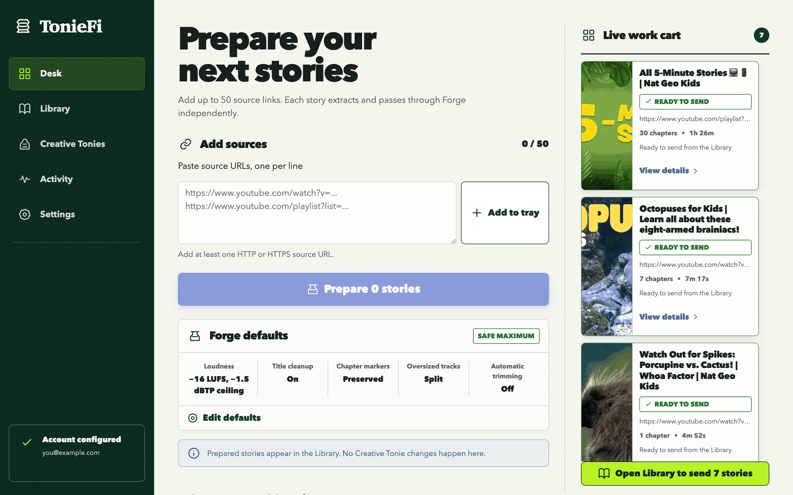
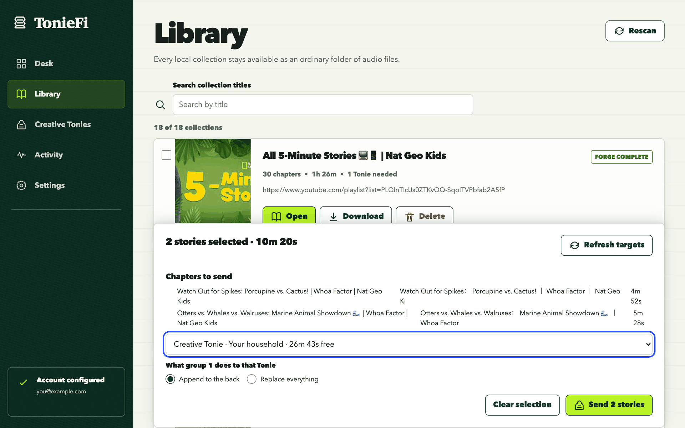
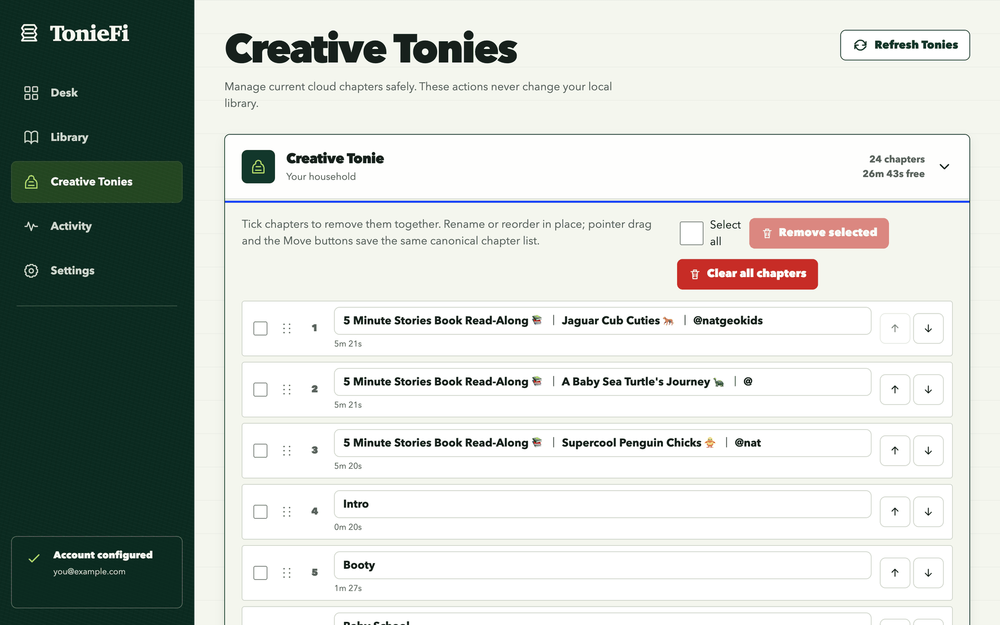

# TonieFi

Self-hosted workspace for Creative Tonies. Paste a few links, let TonieFi clean the audio up,
then choose what goes on which Tonie. The finished library stays on your own disk as ordinary
folders and MP3 files.

```text
Paste sources  ->  automatic cleanup  ->  Library  ->  confirmed send
```

Nothing reaches a Creative Tonie until you pick it, name a target, and press Send.



## How it works

### 1. Add sources on the Desk

Paste up to 50 links, one per line, and press **Prepare**. Each link becomes its own job, so one
dead link never blocks the rest of the batch. You can also search LibriVox or upload your own
files.

Every source is downloaded and then run through **Forge**, which is the automatic cleanup pass:

| Pass | What it does |
|---|---|
| Chapters | Keeps the source's own chapter markers |
| Level | Normalises loudness to −16 LUFS with a −1.5 dBTP ceiling |
| Titles | Strips noise such as `FULL AUDIOBOOK`, `[HD]` and channel-name prefixes |
| Split | Cuts any track too long to fit one Tonie into even parts |
| Trim | Off by default. Set it if your source has an intro to cut |

**Forge defaults** save automatically as one complete local profile. They prefill URL, LibriVox,
and upload preparation and remain editable for each batch. Saves stay ordered when you navigate
away and use unload-safe delivery. An invalid stored profile surfaces an error; a later complete
edit repairs it. The saved profile supplies starting values only. It does not enforce chapter
behavior, so one batch can ignore source chapter markers while another keeps them.

A link with `list=` in it gets a **Pick videos** control. It lists the playlist without
downloading anything, and you untick what you do not want. Only the ticked entries are
downloaded, so removing a video costs nothing. Untick every entry and the row is held back with
an inline error rather than submitted, because none of them is not all of them.

### 2. Choose and send from the Library



The Library lists every local collection. Open one to check its cover, chapter titles, order and
playback, or reorder and rename chapters. **Download** hands you the whole collection as one zip.

Sending starts here. Tick the collections you want and a selection bar appears. It packs them
into capacity groups, one Tonie's worth of audio each, and shows exactly which chapters land in
which group. Every group needs its own Creative Tonie before **Send** unlocks, and two groups
cannot name the same Tonie.

**Append to the back** is the default and sends straight away, because you can remove the added
chapters afterwards. **Replace everything** always asks first and names every affected Tonie,
because it destroys that Tonie's current cloud audio with no undo.

### 3. Tidy a Creative Tonie



The Creative Tonies screen reads the live cloud list before every change. Rename a chapter,
reorder by drag or with the Move buttons, tick several chapters and remove them in one save, or
clear the Tonie completely. Removing and clearing both ask for confirmation.

If the myTonies app or another tab changed the same Tonie first, TonieFi refuses the stale write
and reloads the real list rather than overwriting someone else's edit. These actions only touch
the Tonie Cloud. Your local library is never changed from this screen.

### Work keeps running

Jobs live in SQLite and carry on when you close the browser. **Activity** keeps the 40 most
recent jobs with their progress, errors and retry buttons. A failed preparation can be retried
without losing the original error.

## Quick start

Both modes keep the library in `library/` beside the repository by default.

### Docker

```bash
git clone https://github.com/loubylabs/Toniefi.git
cd Toniefi
docker compose pull
docker compose up -d
```

Open <http://127.0.0.1:8080>. Follow logs with `docker compose logs -f`, stop with
`docker compose down`.

On Linux, set your user and group first so the container does not create root-owned files:

```bash
printf 'TONIEFI_UID=%s\nTONIEFI_GID=%s\n' "$(id -u)" "$(id -g)" >> .env
```

Docker Desktop already maps ownership back to you on macOS and Windows.

### Without Docker

Needs `ffmpeg` and Python 3.10 or newer.

```bash
brew install ffmpeg
./run-local.sh
```

Open <http://127.0.0.1:8080>. `Ctrl-C` stops it, `PORT=9000 ./run-local.sh` moves it.

You can prepare and organise collections with no myTonies account at all. Only reading and
writing Creative Tonies needs one.

## Your files stay yours

```text
library/peter-pan/collection.json
library/peter-pan/cover.jpg
library/peter-pan/001-chapter-i.mp3
library/peter-pan/002-chapter-ii.mp3
```

`collection.json` holds the track order, titles and durations. Files you drop in by hand show up
after a Library rescan. Delete TonieFi and the folders and MP3 files still work in any other
player.

## Before you rely on it

- **The Tonie Cloud API is private and unsupported.** TonieFi is not affiliated with, endorsed by,
  or supported by tonies or Boxine. Endpoints can change without notice. If they do, your local
  library is untouched and the official myTonies app still works.
- **Cloud writes have no undo.** Replacing or clearing a Tonie destroys its current audio.
- **Credentials saved through Settings are stored as plain text** in the local SQLite database.
  Protect the data directory. Environment variables are the safer route. Two-factor myTonies
  accounts are not supported by the current login method.
- **There is no login and no HTTPS.** Do not port-forward TonieFi. Use Tailscale or another
  private network for remote access.
- **Use it for audio you are allowed to copy.** LibriVox is included because its recordings are
  public domain. TonieFi does not bypass DRM.

## Documentation

| Document | What is in it |
|---|---|
| [Configuration](docs/operations/configuration.md) | Every environment variable, compose settings, Unraid, accounts |
| [Troubleshooting](docs/operations/troubleshooting.md) | Sources that will not load, stale `yt-dlp`, common failures |
| [Development](docs/operations/development.md) | Running the test suite, project layout |
| [Architecture](docs/architecture/overview.md) | Modules, background jobs, recovery, storage guarantees |
| [HTTP API](docs/architecture/api.md) | Endpoints and worked `curl` examples |

## License

MIT
